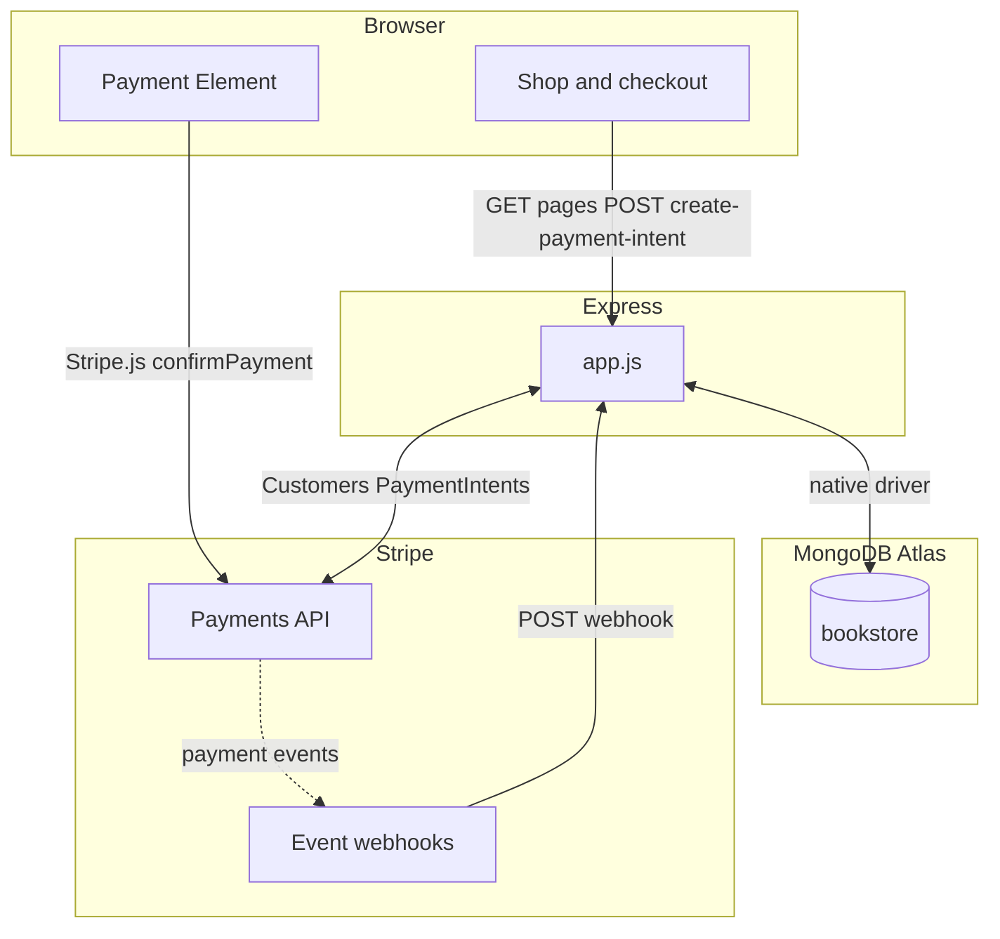

# Stripe Press Bookstore

A reference implementation of a modern e-commerce checkout built on **Stripe Payment Element** and **MongoDB Atlas**. It demonstrates how a typical online store handles the full purchase lifecycle — from product catalogue to payment confirmation — using two complementary platforms: **Stripe** manages money movement and payment state, while **MongoDB** manages business data (catalogue, customers, and orders).

This project is intentionally kept simple and readable. Every route, every database operation, and every Stripe API call is written to be walkable line-by-line with a customer or engineering team. It serves as a practical starting point for teams evaluating how to integrate Stripe Payment Element into a Node.js application, with MongoDB as the operational data layer.

Built with **Node.js / Express**, the **MongoDB native driver**, plain **HTML/CSS**, and **Bootstrap** for layout.

**Branch `foodnow`:** This repo also has a **FoodNow** extension (Stripe Connect + Payment Element + Billing for a restaurant demo). See **[FoodNow platform demo (`foodnow` branch)](#foodnow-platform-demo-foodnow-branch)** below for checkout instructions, env vars, and routes.

### End-to-end purchase flow

The walkthrough below follows a shopper from the **Stripe Press Shop** catalogue through a completed sale. The user chooses **Buy now**, lands on **checkout**, and enters **full name** and **email**. The page then loads the **Stripe Payment Element** (embedded UI): the server has already created a **PaymentIntent**; the Element collects the card and completes that intent when the customer pays.

After the card details are submitted, Stripe finalizes the **PaymentIntent** and the app shows the **order confirmation**. Returning to the shop, the **in-stock count** for that book drops by one. That inventory change is coordinated with payment success using **Stripe webhooks** (so the backend learns the charge succeeded even if the browser navigates away) and a **MongoDB multi-document transaction** so the order moves to **completed** and **stock** is decremented atomically—only when the payment is genuinely successful.

**Animated walkthrough** (GIF hosted on GitHub — catalogue → checkout → Payment Element → confirmation → stock decrease):


---

### How to set up and run the application

#### Prerequisites

- **Node.js** 18 or newer (LTS recommended).
- A **MongoDB Atlas** account and cluster (free tier is fine; a **replica set** is required for multi-document **transactions** used for inventory). Create a database user and allow your IP (or `0.0.0.0/0` for quick demos—tighten for real use).
- A **Stripe** account in test mode (`sk_test_…`, `pk_test_…`).

#### Project layout (orient yourself first)

| Path | Role |
|------|------|
| `app.js` | Express routes: shop, checkout, PaymentIntent creation, confirmation, webhook. |
| `db.js` | Single MongoDB **client** and **db**; creates unique index on **`payment_events.stripe_event_id`**. |
| `seed.js` | Resets **`products`** and inserts three books; ensures **`payment_events`** index exists. |
| `lib/checkoutHelpers.js` | Stripe customer helper, order insert, **transactional** order completion + stock, webhook **audit** helper, conversion from MongoDB dollars to Stripe cents. |
| **`public/js/checkout.js`** | **Stripe Payment Element and browser flow:** calls `/create-payment-intent`, mounts Elements, **`confirmPayment`**—the main client-side payment execution. |
| `views/` | Handlebars templates (HTML). |
| `public/` | Static assets; book covers live under **`public/images/`**. |

#### Money in MongoDB vs Stripe (read this once)

| Layer | How money is represented | Why |
|-------|-------------------------|-----|
| **MongoDB** (`products.price`, `orders.amount`) | **Dollars** as decimal numbers (e.g. `23.00`) | Easier for people to read in Atlas, exports, and support tooling; matches how prices are usually discussed in business. |
| **Stripe API** (`PaymentIntent.amount`) | **Cents** as a **whole number** (e.g. `2300` for USD) | Stripe’s API uses integer smallest-currency units so amounts are not subject to floating-point rounding errors—a standard pattern for payment systems. |

The server converts **dollars → cents** only when calling Stripe (`Math.round(dollars × 100)`). You do not store cents in MongoDB in this project.

#### Step-by-step setup

1. **Clone** this repository (or use your existing copy) and open the project folder.

2. **Install dependencies**

   ```bash
   npm install
   ```

3. **Environment variables** — copy `.env.example` to `.env` and fill in real values:

   | Variable | Purpose |
   |----------|---------|
   | `STRIPE_SECRET_KEY` | Server-side Stripe API key (`sk_test_…`). |
   | `STRIPE_PUBLISHABLE_KEY` | Browser-side key for Stripe.js (`pk_test_…`). |
   | `STRIPE_WEBHOOK_SECRET` | Signing secret for `/webhook` (`whsec_…` from Stripe CLI or Dashboard). |
   | `MONGODB_URI` | Atlas connection string (include user, password, and options). |
   | `PORT` | HTTP port (default `3000`). |

4. **Database** — the app uses `client.db('bookstore')`. Collections are created when you seed, when the app starts, and when you run checkout.

5. **Seed the product catalogue**

   ```bash
   node seed.js
   ```

   This recreates **`products`** (prices in **dollars**, e.g. `23.00`) and ensures the **`payment_events`** index exists so the collection is visible in Atlas.

6. **Run the app**

   ```bash
   npm start
   ```

   Open `http://localhost:3000`.

   **Tip:** If `STRIPE_WEBHOOK_SECRET` is already set in `.env` before you start the server, you do not need a restart when you begin testing. You only need to **restart after editing `.env`** if you add or change the webhook secret (for example, after copying a new `whsec_…` from `stripe listen`) while the process was already running.

#### Stripe webhook for local testing (Stripe CLI)

Stripe must be able to reach your server for `payment_intent.succeeded`. Locally, use the Stripe CLI to forward events:

1. Install the [Stripe CLI](https://stripe.com/docs/stripe-cli) and log in (`stripe login`).

2. In a second terminal, run:

   ```bash
   stripe listen --forward-to localhost:3000/webhook
   ```

3. The CLI prints a **webhook signing secret** starting with `whsec_`. Add it to `.env` as `STRIPE_WEBHOOK_SECRET`. If the app was already running without this value, restart once so it picks up the new variable.

4. Leave `stripe listen` running while you test payments so webhooks reach your machine and **`payment_events`** is populated alongside the confirmation page flow.

#### Test card numbers

| Card number | Behaviour |
|-------------|-----------|
| `4242 4242 4242 4242` | Succeeds immediately (any future expiry, any CVC). |
| `4000 0025 0000 3155` | **3D Secure authentication** — Stripe prompts for a test authentication step. Strong demo for **enterprise and international** buyers: many regions require SCA-style flows; Stripe handles the bank challenge UI so your integration stays compliant without building redirect flows yourself. |
| `4000 0000 0000 9995` | Declines (insufficient funds) — useful to show a failed attempt and a `pending` order that never completes. |

Use any future expiry date and any three-digit CVC (use `123` for the 3DS flow when prompted).

#### Verify end-to-end (after a successful test payment)

Use a success card (e.g. `4242…` or complete the `4000 0025…` authentication). Then confirm:

| Where | What you should see |
|-------|---------------------|
| **Stripe Dashboard** (Developers → Events, or Payments) | A **PaymentIntent** in **succeeded** state for the charged amount; webhook events such as `payment_intent.succeeded` if you used the CLI. |
| **MongoDB Atlas** → **`bookstore`** → **`orders`** | One document with **`status`: `completed`**, **`stripe_payment_intent_id`** matching the Dashboard PI, **`amount`** in **dollars** matching the book price. |
| **MongoDB** → **`products`** | **`stock`** decreased by **1** for that title (if it was not already completed by a duplicate path). |
| **MongoDB** → **`payment_events`** | Rows with **`stripe_event_id`** (`evt_…`), **`event_type`**, **`processed_successfully`**, and the stored **`payload`**. |

If something fails, check the server logs and that `stripe listen` is forwarding to the same port as your app.

---

### FoodNow platform demo (`foodnow` branch)

The **`foodnow`** branch extends this project with a second, parallel demo: **FoodNow**, a fictional food-delivery platform featuring **Malay Kitchen**. It is meant for Solutions Architect walkthroughs and keeps the original **Stripe Press** bookstore routes unchanged. All FoodNow URLs are prefixed with **`/foodnow`**.

It demonstrates three Stripe surfaces together:

| Topic | What the demo shows |
|-------|---------------------|
| **Stripe Connect** | Destination charges: the customer pays the full order amount; **`application_fee_amount`** keeps a platform percentage for FoodNow; the rest is transferred to the connected account (**Malay Kitchen**). |
| **Payment Element** | Same embedded checkout pattern as the bookstore, applied to a single menu item checkout. |
| **Stripe Billing** | **FoodNow Plus** — AU$9.90/month subscription (`default_incomplete` + Payment Element for the first invoice). |

#### Prerequisites (in addition to the main app)

- **Stripe Connect** enabled on your Stripe account (test mode is fine). The one-time setup script creates a **Custom** connected account with Stripe’s **test-mode bypass** fields so you can run transfers without live onboarding.
- Same **MongoDB Atlas** cluster (replica set) as the bookstore — FoodNow uses additional collections in the same **`bookstore`** database.

#### Check out the branch

```bash
git fetch origin
git checkout foodnow
```

If you work from a fork, ensure **`origin`** points at your Git remote (for example `https://github.com/waiweng/stripe-mongodb-checkout`).

#### Install and base `.env`

Follow **Install dependencies** and copy **`.env.example`** → **`.env`** as in the main setup. You still need `STRIPE_*`, `MONGODB_URI`, and `STRIPE_WEBHOOK_SECRET` for webhooks.

#### FoodNow-specific environment variables

Add or fill these (see **`.env.example`**):

| Variable | Purpose |
|----------|---------|
| **`RESTAURANT_CONNECTED_ACCOUNT_ID`** | Connected account id (`acct_…`) for Malay Kitchen. Written automatically by the Connect setup script (see below). |
| **`PLATFORM_FEE_PERCENT`** | Platform fee as a percent of the order (e.g. `15` for 15%). |
| **`FOODNOW_PLUS_PRICE_ID`** | Optional. Leave empty to auto-create a **FoodNow Plus** recurring Price on first subscription; the app can append the new id to **`.env`**. |
| **`STRIPE_WEBHOOK_SECRET_FOODNOW`** | Optional. Use if you register a **second** webhook endpoint in the Dashboard that points only at **`/foodnow/webhook`**; otherwise the main **`STRIPE_WEBHOOK_SECRET`** used with **`/webhook`** is enough. |

#### One-time Stripe Connect setup (Malay Kitchen)

From the project root, with **`STRIPE_SECRET_KEY`** set in **`.env`**:

```bash
npm run setup:connect
```

This runs **`setup-connect.js`**, which creates a **Custom** AU connected account (test bypass data), then updates **`RESTAURANT_CONNECTED_ACCOUNT_ID`** in **`.env`**. Restart the app after it runs so `process.env` picks up the new value.

#### Seed the FoodNow menu

```bash
npm run seed:foodnow
```

This recreates the **`foodnow_menu`** collection with three Malaysian dishes (prices in **AUD**). Run **`node seed.js`** first if you still want the bookstore catalogue.

#### Run the app and open FoodNow

```bash
npm start
```

- **FoodNow home:** [http://localhost:3000/foodnow](http://localhost:3000/foodnow)  
- **Bookstore (unchanged):** [http://localhost:3000](http://localhost:3000)  
- **FoodNow Plus:** [http://localhost:3000/foodnow/subscribe](http://localhost:3000/foodnow/subscribe)

Use the same test cards as in the table above (e.g. **`4242 4242 4242 4242`**).

#### Webhooks (FoodNow + bookstore)

The main **`POST /webhook`** handler processes **`payment_intent.succeeded`** for both bookstore orders and FoodNow orders (FoodNow PaymentIntents include metadata so the correct MongoDB completion runs). It also handles **`invoice.payment_succeeded`** for FoodNow Plus so subscription state stays in sync.

For local testing, one Stripe CLI forwarder is usually enough:

```bash
stripe listen --forward-to localhost:3000/webhook
```

Copy the printed **`whsec_…`** into **`STRIPE_WEBHOOK_SECRET`** and restart **`npm start`** if needed.

Optionally, add a Dashboard endpoint for **`/foodnow/webhook`** and set **`STRIPE_WEBHOOK_SECRET_FOODNOW`** to that endpoint’s signing secret.

#### FoodNow routes (summary)

| Method | Path | Role |
|--------|------|------|
| GET | **`/foodnow`** | Menu (reads **`foodnow_menu`**). |
| GET | **`/foodnow/checkout`** | Checkout for one dish (`menuItemId` query). |
| POST | **`/foodnow/create-payment-intent`** | Creates Connect **PaymentIntent** + pending **`foodnow_orders`** row. |
| GET | **`/foodnow/confirmation`** | Order confirmation after pay. |
| GET | **`/foodnow/subscribe`** | FoodNow Plus landing page. |
| POST | **`/foodnow/create-subscription`** | Creates incomplete subscription; returns client secret (and subscription id for the return URL). |
| GET | **`/foodnow/subscription-confirmation`** | After subscription payment redirect. |
| POST | **`/foodnow/webhook`** | Optional dedicated webhook URL (same event types as above for FoodNow-related events). |

#### FoodNow files and MongoDB collections

| Path / collection | Role |
|-------------------|------|
| **`lib/foodnowHelpers.js`** | Connect PaymentIntent creation, fee math, FoodNow Plus subscription helper, FoodNow order completion transaction. |
| **`seed-foodnow.js`** | Seeds **`foodnow_menu`**. |
| **`setup-connect.js`** | One-time Custom Connect account + **`.env`** update. |
| **`views/foodnow/*.hbs`** | FoodNow pages. |
| **`public/js/foodnow-checkout.js`**, **`public/js/foodnow-subscribe.js`** | Payment Element flows for orders and subscriptions. |
| **`foodnow_menu`** | Menu items (name, price, image filename, stock, …). |
| **`foodnow_customers`** | Shoppers (linked to Stripe Customer id). |
| **`foodnow_orders`** | Food orders (pending → completed; ties to **`stripe_payment_intent_id`**). |
| **`foodnow_subscriptions`** | FoodNow Plus rows (`pending` / `active`). |

The original **`products`**, **`orders`**, **`customers`**, and **`payment_events`** collections still support the bookstore demo on the same branch.

---

### How the solution works

#### Payment flow in plain English

1. The **home page** loads every book from **`products`** and shows cover art from `public/images/`. **Stock** is shown on each card.

2. The shopper opens **checkout** with a `productId`, enters **name** and **email**, then **Continue to secure payment**.

3. The browser **POSTs** to **`/create-payment-intent`**. The server:

   - Finds or creates a **Stripe Customer** for that email.
   - **Upserts** **`customers`** with the Stripe customer id.
   - Creates a **PaymentIntent** with Stripe’s **`amount` in cents**, converted from the **dollar** price stored in MongoDB.
   - Inserts a **`pending`** row in **`orders`** with **`amount` in dollars** (snapshot) and `stripe_payment_intent_id` (`pi_…`).
   - Returns the **`client_secret`** to the browser.

4. **`public/js/checkout.js`** loads **Stripe.js**, mounts the **Payment Element**, and the shopper pays. On success, Stripe redirects the browser to **`/confirmation`**.

5. **Completing the order (same logic, two ways Stripe can tell you payment succeeded):**

   - **`GET /confirmation`** — The shopper lands here after paying. The server asks Stripe whether that **PaymentIntent** is **`succeeded`**, then runs **one MongoDB transaction**: if the order is still **`pending`**, set it to **`completed`** and **decrement** the product’s **`stock`** by 1. If the order is already **`completed`**, the transaction does nothing further (safe if something else already finished the sale).

   - **`POST /webhook`** — Independently, Stripe sends events to your server (for example when you use **`stripe listen`**). **Every** event is stored in **`payment_events`** (full payload, **`evt_…`** id) for **audit**. When the event is **`payment_intent.succeeded`**, the app runs the **same** completion transaction as above. Stripe may deliver the same event more than once; the **`evt_…`** id is used so duplicate deliveries are not double-processed—important for **idempotency** and **reconciliation**.

   In practice, **either** the redirect **or** the webhook may run first, or **both**. The shared transaction and order state make that safe.

#### Stripe APIs used and why

| API / surface | Why |
|---------------|-----|
| **Customers** | Stable identity per email; receipts and future saved payment methods can use the same `cus_…` id. |
| **PaymentIntents** | One intent per checkout attempt; **`client_secret`** powers Stripe.js without exposing the secret key. |
| **Payment Element** | Embedded UI; card data goes to Stripe, not your server. |
| **Webhooks** | Server-to-server confirmation; complements the browser redirect to `/confirmation`. |

#### How MongoDB fits in

| Collection | What it stores | Why |
|------------|----------------|-----|
| **`products`** | Title, author, description, **price (dollars)**, currency, **`image_filename`**, **stock**, timestamps. | Catalogue and inventory. |
| **`customers`** | Name, email, **`stripe_customer_id`**, `created_at`. | Links shoppers to Stripe. |
| **`orders`** | `customer_id`, `product_id`, **`product_title`** (snapshot), **amount (dollars, matches Stripe charge after conversion)**, currency, **`status`**, **`stripe_payment_intent_id`**, timestamps. | Purchase attempts; **`stripe_payment_intent_id`** joins to Stripe. |
| **`payment_events`** | **`stripe_event_id`** (`evt_…`, unique), **event_type**, **payload**, **`processed_successfully`**, **`received_at`**, optional error fields. | **Audit** and **deduplication** when Stripe retries webhooks. |

#### Architecture



**Flows in words:** the shopper loads the catalogue from **MongoDB**, starts checkout, and the server creates a **PaymentIntent** on **Stripe** while writing **pending** orders (and customers) to **MongoDB**. The **Payment Element** completes payment with **Stripe**. After that, **completion** runs in **MongoDB** (order **`completed`** + **stock** down by 1) from **`/confirmation`** and/or from **`payment_intent.succeeded`** webhooks—same transaction helper in code. **`stripe_payment_intent_id`** ties **`orders`** to **`pi_…`**; **`payment_events`** stores **`evt_…`** for each webhook delivery.

---

### How I approached this problem

#### Documentation that helped most

- [Accept a payment](https://stripe.com/docs/payments/accept-a-payment) — PaymentIntent + client-side confirmation.
- [Payment Element](https://stripe.com/docs/payments/payment-element) — mounting the Element and `confirmPayment`.
- [Customers](https://stripe.com/docs/api/customers) — list by email and create when missing.
- [Webhooks](https://stripe.com/docs/webhooks) — raw body verification and `payment_intent.succeeded`.
- [MongoDB Node.js driver](https://www.mongodb.com/docs/drivers/node/current/) — connections, **transactions**, CRUD.

#### PaymentIntent and `client_secret`

The server creates a PaymentIntent with **amount in cents** (from your dollar catalogue). Stripe returns a **client secret** usable in the browser **only** with Stripe.js. After a successful payment, Stripe can redirect back with the PaymentIntent id in the URL.

#### Why Payment Element instead of Stripe Checkout

**Stripe Checkout** is a hosted page—you redirect away and customise within Checkout’s limits. **Payment Element** stays on your site: you control layout, copy, and fields beside the card form, which many enterprises want for brand and policy context.

---

### How I would extend this for a production application

#### Webhook reliability and idempotency

**Business problem:** You must not fulfill twice if Stripe retries the same webhook. **This project** logs every delivery in **`payment_events`** and uses **`evt_…`** for deduplication. **Further:** durable idempotency keys, `200` only after successful processing, queues for slow work.

#### Saved payment methods using the Stripe Customer id

**Business problem:** Returning customers should not re-enter card details every time. **Approach:** **`stripe_customer_id`** in **`customers`** supports saved payment methods via SetupIntents or saved PMs on the Customer.

#### Inventory management

**Business problem:** Do not oversell. **This project** already decrements **`stock`** in the **same transaction** as marking **`orders`** **`completed`**. **Extensions:** reservations at PaymentIntent creation, low-stock alerts, refunds when stock cannot be allocated.

#### Refunds

**Business problem:** Returns and finance reconciliation. **Approach:** Stripe **Refund API** + order status updates and refund ids in MongoDB.

#### Order history page

**Business problem:** Support and self-service history. **Approach:** Query **`orders`** by **`customer_id`** or email (via **`customers`**), behind authentication later.

#### Revenue analytics with aggregation

**Business problem:** Reporting by period, SKU, channel. **Approach:** Aggregation on **`orders`** with `status: "completed"` and **`amount`** in dollars.

#### Multi-currency with Stripe Adaptive Pricing

**Business problem:** International pricing without duplicate catalogues everywhere. **Approach:** Stripe **Adaptive Pricing** plus a canonical price or product reference in MongoDB.
